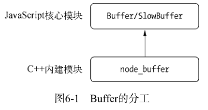
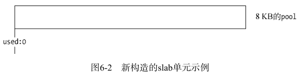
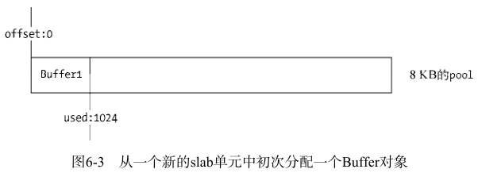
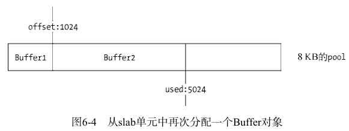

# Buffer 缓冲区
Buffer 类是 JavaScript [Uint8Array](https://developer.mozilla.org/zh-CN/docs/Web/JavaScript/Reference/Global_Objects/Uint8Array) 类的子类，Node.js API 在支持 Buffer 的地方也接受普通的 Uint8Array。

在计算机中，存储的数据用二进制表示。二进制数据的最小单位为 bit（比特)，每个 bit 的值为 0 或 1，8 个 bit 为一个字节。Buffer 用于存储二进制数据，并且提供了一系列方法对其进行增删改查等操作。

由于二进制数据都是 0 或 1，对于人来说，是很难阅读的。因此有了各种编码集，例如互联网最常用的 Unicode 编码。它在将数据存到计算机时先编码成 0/1 的格式再存储，需要读取时再对二进制数据进行转换，转成我们能够轻易理解的格式。

下面看一个简单的数据格式转换示例：
```js
// 将字符串转成 buffer
const buf = Buffer.from('abcdefghijklmnopqrstuvwxyz')
const n = buf[1]

// buffer 中的每个数字代表一个字节，Unicode 编码。
// 16 进制的数字
console.log(typeof buf, buf) // object <Buffer 61 62 63 64 65 66 67 68 69 6a 6b 6c 6d 6e 6f 70 71 72 73 74 75 76 77 78 79 7a>

// 读取单个字节会用十进制数字表示
console.log(typeof buf[0], buf[0]) // number 97
console.log(typeof n, n) // number 98

// 转成数组会变成十进制数字
console.log(Array.from(buf))
/*
[
    97,  98,  99, 100, 101, 102,
   103, 104, 105, 106, 107, 108,
   109, 110, 111, 112, 113, 114,
   115, 116, 117, 118, 119, 120,
   121, 122
]
*/
```
上面的代码把字符串转成了 Buffer，然后分别用十六进制、十进制的格式进行输出。

Node.js 目前支持的字符编码包括：
* ascii - 仅支持 7 位 ASCII 数据。如果设置去掉高位的话，这种编码是非常快的。
* utf8 - 多字节编码的 Unicode 字符。许多网页和其他文档格式都使用 UTF-8 。
* utf16le - 2 或 4 个字节，小字节序编码的 Unicode 字符。支持代理对（U+10000 至 U+10FFFF）。
* ucs2 - utf16le 的别名。
* base64 - Base64 编码。
* latin1 - 一种把 Buffer 编码成一字节编码的字符串的方式。
* binary - latin1 的别名。
* hex - 将每个字节编码为两个十六进制字符。

当在 Buffer 和字符串之间进行转换时，如果未指定字符编码，则默认使用 UTF-8。

下面用不同的格式来输出同一个 Buffer：
```js
const buf = Buffer.from('abcdefghijklmnopqrstuvwxyz')

console.log(buf.toString('ascii')) // abcdefghijklmnopqrstuvwxyz
console.log(buf.toString('utf8')) // abcdefghijklmnopqrstuvwxyz
console.log(buf.toString('utf16le')) // 扡摣晥桧橩汫湭灯牱瑳癵硷穹
console.log(buf.toString('ucs2')) // 扡摣晥桧橩汫湭灯牱瑳癵硷穹
console.log(buf.toString('base64')) // YWJjZGVmZ2hpamtsbW5vcHFyc3R1dnd4eXo=
console.log(buf.toString('latin1')) // abcdefghijklmnopqrstuvwxyz
console.log(buf.toString('binary')) // abcdefghijklmnopqrstuvwxyz
console.log(buf.toString('hex')) // 6162636465666768696a6b6c6d6e6f707172737475767778797a
```
## 创建 Buffer 的各种方法
Buffer 提供了以下 API 来创建 Buffer 类：

-   **Buffer.alloc(size[, fill[, encoding]])：**  返回一个指定大小的 Buffer 实例，如果没有设置 fill，则默认填满 0
-   **Buffer.allocUnsafe(size)：**  返回一个指定大小的 Buffer 实例，但是它不会被初始化，所以它可能包含敏感的数据

-   **Buffer.from(array)：**  返回一个被 array 的值初始化的新的 Buffer 实例（传入的 array 的元素只能是数字，不然就会自动被 0 覆盖）
-   **Buffer.from(arrayBuffer[, byteOffset[, length]])：**  返回一个新建的与给定的 ArrayBuffer 共享同一内存的 Buffer。
-   **Buffer.from(buffer)：**  复制传入的 Buffer 实例的数据，并返回一个新的 Buffer 实例
-   **Buffer.from(string[, encoding])：**  返回一个被 string 的值初始化的新的 Buffer 实例
-   **Buffer.slice([start[, end]])：**  返回新的 Buffer，其引用与原始缓冲区相同的内存，但由 start 和 end 索引进行偏移和裁剪。

```js
// 创建长度为 10 的以零填充的缓冲区。
const buf1 = Buffer.alloc(10);

// 创建长度为 10 的缓冲区，
// 使用值为 `1` 的字节填充。
const buf2 = Buffer.alloc(10, 1);

// 创建长度为 10 的未初始化的缓冲区。
// 这比调用 Buffer.alloc() 快，
// 但返回的缓冲区实例可能包含旧数据，
// 需要使用 fill()、write() 、
// 或其他填充缓冲区内容的函数重写。
const buf3 = Buffer.allocUnsafe(10);

// 创建包含字节 [1, 2, 3] 的缓冲区。
const buf4 = Buffer.from([1, 2, 3]);

// 创建包含字节 [1, 1, 1, 1] 的缓冲区，
// 所有条目都使用 `(value & 255)` 截断以符合范围 0–255。
const buf5 = Buffer.from([257, 257.5, -255, '1']);

// 创建包含字符串 'tést' 的 UTF-8 编码字节的缓冲区：
// [0x74, 0xc3, 0xa9, 0x73, 0x74]（十六进制）
// [116, 195, 169, 115, 116]（十进制）
const buf6 = Buffer.from('tést');

// 创建包含 Latin-1 字节 [0x74, 0xe9, 0x73, 0x74] 的缓冲区。
const buf7 = Buffer.from('tést', 'latin1');

// slice
const buf8 = Buffer.from('Hey!')
buf8.slice(0).toString() //Hey!
const slice = buf8.slice(0, 2)
console.log(slice.toString()) //He
buf8[1] = 111 //o
console.log(slice.toString()) //Ho
```

## Buffer 内存分配
### 模块结构
Buffer 是一个 JS 和 C++ 结合的模块，性能部分由 C++ 实现，非性能部分由 JS 实现。



Buffer 所占用的内存属于堆外内存，它在 node 进程启动时就已经加载了，并放在全局对象下。所以使用 Buffer 时，无须用 `require()` 加载，可直接使用。

Buffer 内存分配是在 node 的 C++ 层面实现内存申请的。即采用在 C++ 层面申请内存、在 JS 中分配内存的策略。

为了高效地使用申请来的内存，node 采用了 slab 分配机制。它具有 3 种状态：
1. full: 完全分配状态。
2. partial: 部分分配状态。
3. empty: 未分配状态。


node 以 8KB 的界限来区分 Buffer 是大对象还是小对象。8KB 也就是每个 slab 的大小值，在 JS 层面，以它作为单位进行内存的分配。

### 分配小 Buffer 对象
如果指定的 Buffer 对象小于 8KB，node 会按照小对象的方式分配内存。
```js
var pool;
function allocPool() {
    pool = new SlowBuffer(Buffer.poolSize);
    pool.used = 0;
}
```







同一个 slab 可能分配给多个 Buffer 对象使用，只有这些小对象在作用域释放并都可以回收时，slab 的 8KB 空间才会被回收。

### 分配大 Buffer 对象
如果需要超过 8KB 的 Buffer 对象，将会直接分配一个 SlowBuffer 对象作为 slab 单元，这个 slab 单元将会被这个大 Buffer 独占。
```js
// Big buffer, just alloc one
this.parent = new SlowBuffer(this.length);
this.offset = 0;
```
SlowBuffer 类是在 C++ 中定义的，虽然引用 buffer 模块可以访问它，但不推荐直接操作它，而是用 Buffer 替代。


## Buffer 的拼接
Buffer 在使用场景中，通常是以一段一段的方式传输的。
```js
var fs = require('fs');
var rs = fs.createReadStream('test.md');
var data = '';
rs.on("data", function (chunk){
    data += chunk;
});
rs.on("end", function () {
    console.log(data);
});
```
其中 `data += chunk;` 代码的隐藏操作为 `data = data.toString() + chunk.toString();`，对于传输英文文本，`toString()` 不会造成问题。
但对于宽字节的中文，就有可能造成乱码。utf-8 中文通常是占 3 字节的，以上的操作有可能会对一个中文的 3 字节进行截断，导致乱码。

### setEncoding() 与 string_decoder()
可读流有一个设置编码的方法 `setEncoding()`：
```js
readable.setEncoding(encoding)
```
该方法的作用是让 data 事件中传递的不再是 Buffer 对象，而是编码后的字符串：
```js
var rs = fs.createReadStream('test.md', { highWaterMark: 11});
rs.setEncoding('utf8');
```
乱码问题可以通过 decoder 对象解决。在调用 `setEncoding()` 方法时，可读流对象在内部会生成一个 decoder 对象。当它解释到截断的中文字节时，不会对其进行转码，而是缓存起来，等到剩余的字节也读取成功时，才进行转码。
```js
const stringDecoder = require('string_decoder').StringDecoder
const decoder = new stringDecoder('utf-8')
// “你好”占六个字节，当第一次读取到五个字节时，只转码前三个字节。等到后面把剩余的一个字节补足时才进行转码。
console.log(decoder.write(Buffer.from(['0xe4', '0xbd', '0xa0', '0xe5', '0xa5']))) // 你
console.log(decoder.write(Buffer.from(['0xbd']))) // 好
```

### 正确拼接 Buffer
除了 `setEncoding()` 方法外，还可以将多个小 Buffer 对象拼接到一起再解析。
```js
var chunks = [];
var size = 0;
res.on('data', function (chunk) {
    chunks.push(chunk);
    size += chunk.length;
});
res.on('end', function () {
    var buf = Buffer.concat(chunks, size);
    var str = iconv.decode(buf, 'utf8');
    console.log(str);
});
```
`Buffer.concat()` 方法封装了从小 Buffer 对象向大 Buffer 对象的复制过程：
```js
Buffer.concat = function(list, length) {
    if (!Array.isArray(list)) {
        throw new Error('Usage: Buffer.concat(list, [length])');
    }

    if (list.length === 0) {
        return new Buffer(0);
    } else if (list.length === 1) {
        return list[0];
    }

    if (typeof length !== 'number') {
        length = 0;
        for (var i = 0; i < list.length; i++) {
            var buf = list[i];
            length += buf.length;
        }
    }

    var buffer = Buffer.alloc(length);
    var pos = 0;
    for (var i = 0; i < list.length; i++) {
        var buf = list[i];
        buf.copy(buffer, pos);
        pos += buf.length;
    }

    return buffer;
};
```

## Buffer 与性能
Buffer 在网络 I/O 和文件 I/O 中使用广泛，通常在网络传输中，字符串都需要转换为 Buffer，这样能提升性能。

通过预先将静态资源转成 Buffer，可以节省在每次响应时的转换时间，有效地减少 CPU 的重复使用。
```js
const str = 'abc...' // 一段很长的静态资源文本
const buf = Buffer.from(str) // 提前转换为 buf，这样每次响应时，直接传输 buf 就行


http.createServer((req, res) => {
    // res.send(str) 如果传输的是字符串，每次响应时还得进行转换
    res.send(buf)
}
```
## 参考资料
* [深入浅出Node.js](https://book.douban.com/subject/25768396/)
* [Node.js Buffer(缓冲区)](https://www.runoob.com/nodejs/nodejs-buffer.html)
* [Node.js Buffer](http://nodejs.cn/learn/nodejs-buffers)
* [buffer](http://nodejs.cn/api/buffer.html)
